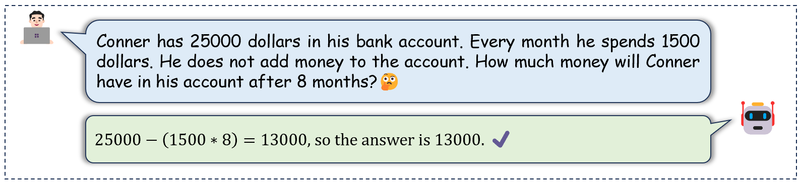
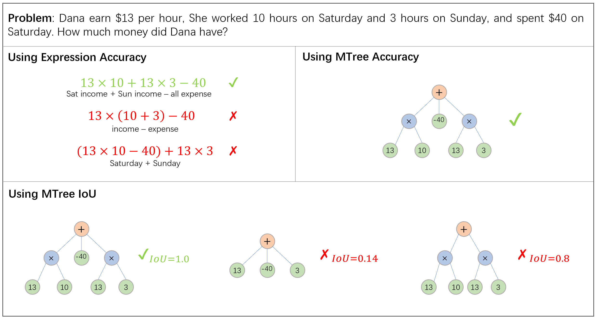

## Non-Autoregressive Math Word Problem Solver with Unified Tree Structure 

This is the offcial repo for the paper "[Non-Autoregressive Math Word Problem Solver with Unified Tree Structure](
http://arxiv.org/abs/2305.04556)".

<div align="center">
  
</div>

### Requirements

* Pytorch = 1.13.1;
* You can see the `requirements.txt` in each dictionary, run `pip install -r requirements.txt` to get environment ready.

### Datasets

Before you use the code in `Math23K` dictionary, please download the missing train dataset from this [link](https://pan.baidu.com/s/17t6NZUjDW9MJdi0UzK9TJg?pwd=q61p) and put it in `./Math23K/datasets/`.

### Usage

#### Train
To train our model on Math23K, run:
```
python ./Math23K/main.py --mode train
```
To train our model on MAWPS, run:
```
python ./MAWPS/main_mawps.py
```
#### Test

If you want to load the check points, please make sure you have downloaded the required files:
* [Math23K check points](https://pan.baidu.com/s/1CQgW2mV3Mt7ry6gKIw9j3Q?pwd=28iz)
* [MAWPS check points](https://pan.baidu.com/s/1_tTEemyCXZQ0H4gkFOuqJg?pwd=pzy1)

Please put the check point files(Math23K and MAWPS) in `./Math23K/check_points/` and `./MAWPS/check_points/`.

To use the check points and test the model on Math23K, run:
```
python ./Math23K/main.py --mode test
```
To use the check points and test the model on MAWPS, run:
```
python ./MAWPS/test_mawps.py
```

#### MTree Acc and MTree IoU Evaluation

**MTree Acc** is proposed to solve the problem of mathematical expression variants and alleviate the drawback that Expression Acc underestimates the performance of MWP solvers. MTree IoU is proposed to evaluate the partial correctness of the prediction expression obtained by MWP solvers.

<div align="center">
  
</div>


In `./Evaluation/` we provide a tool to evaluate **MTree Acc** and **MTree IoU**. Just prepare the prediction from your model and target as the format of `./Evaluation/examples.json`, then run:
```
python ./Evaluation/evaluate.py
```

#### Citation
#
If this repo is helpful to your work, please kindly cite our paper:
```
@article{mwpnas2023,
  title={Non-Autoregressive Math Word Problem Solver with Unified Tree Structure},
  author={Bin, Yi and Han, Mengqun and Shi, wenhao and Wang, Lei and Yang, Yang and Shen, Heng Tao},
  journal={arXiv preprint arXiv:2305.04556},
  year={2023}
}
```
